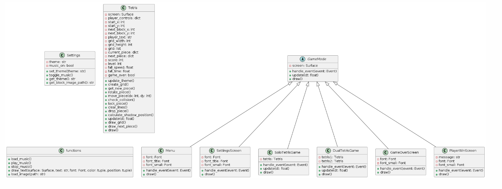
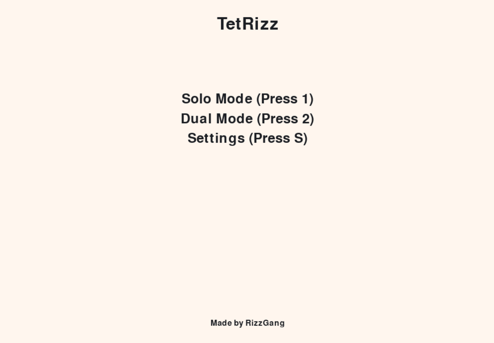
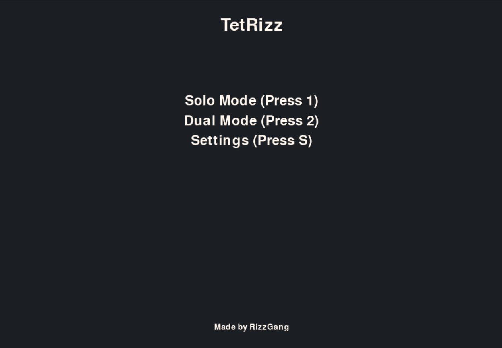
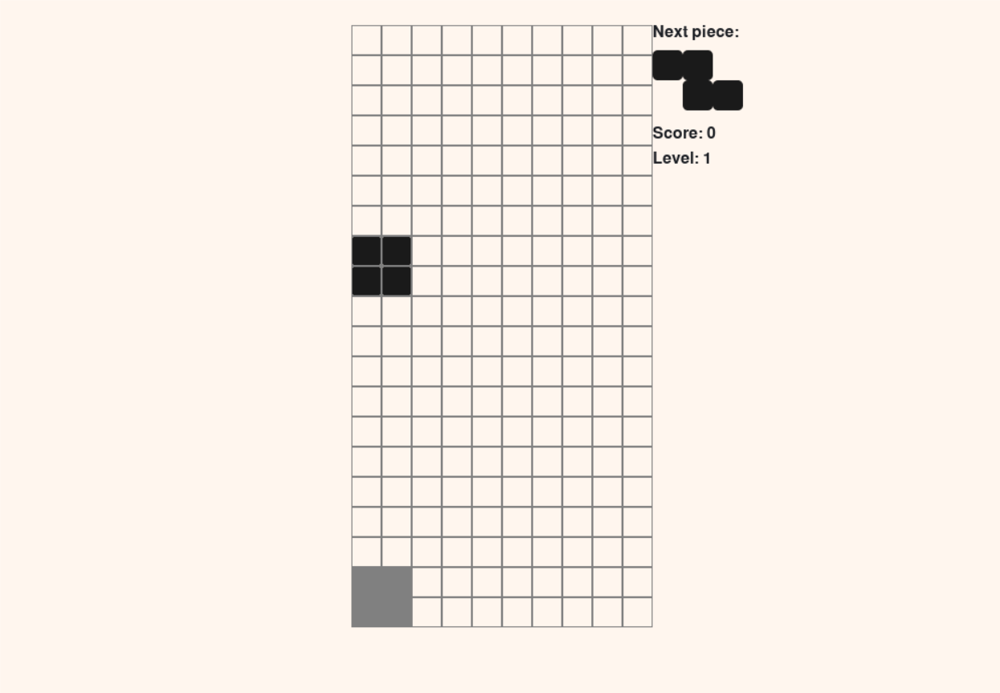
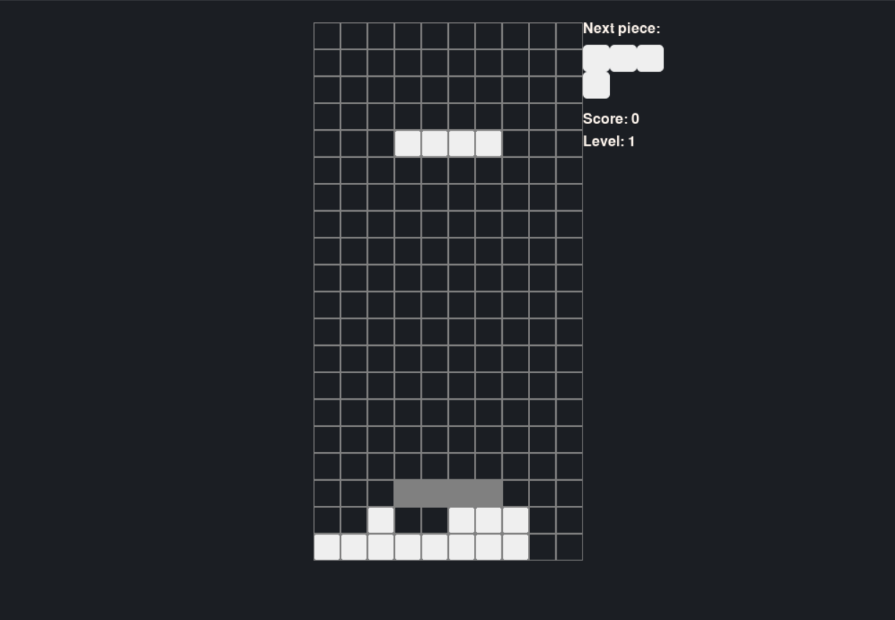
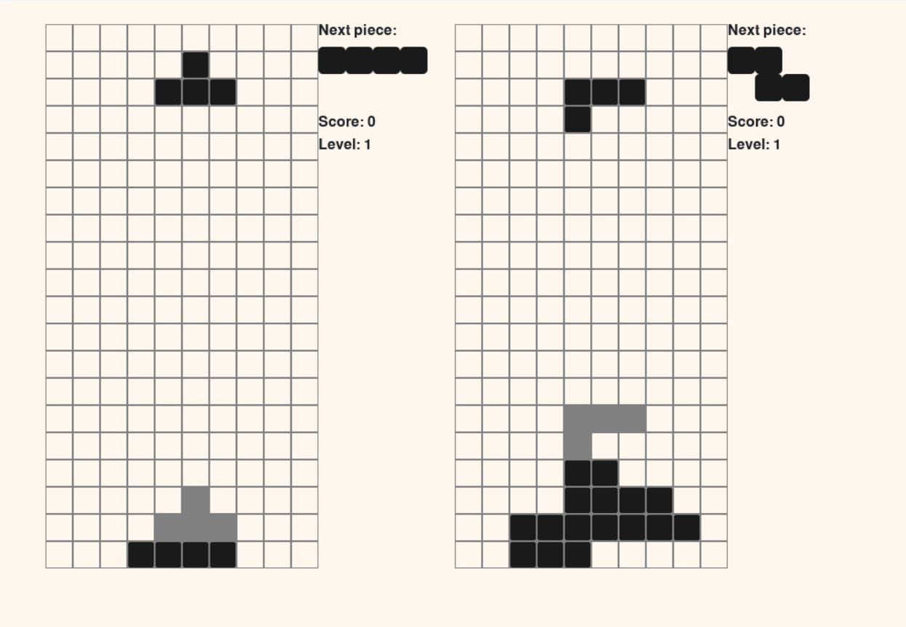
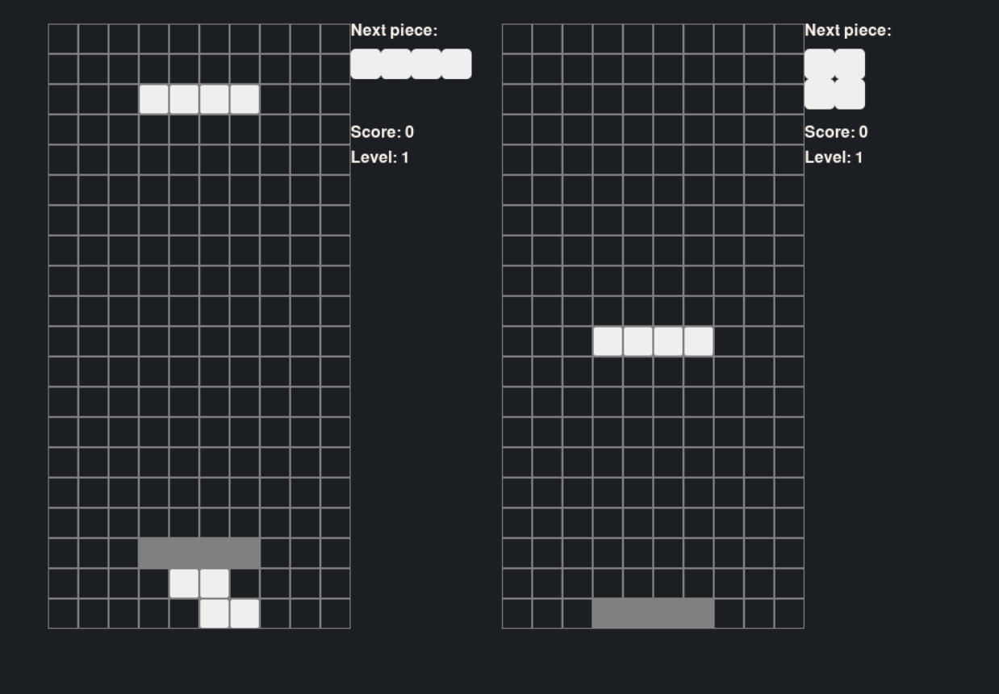
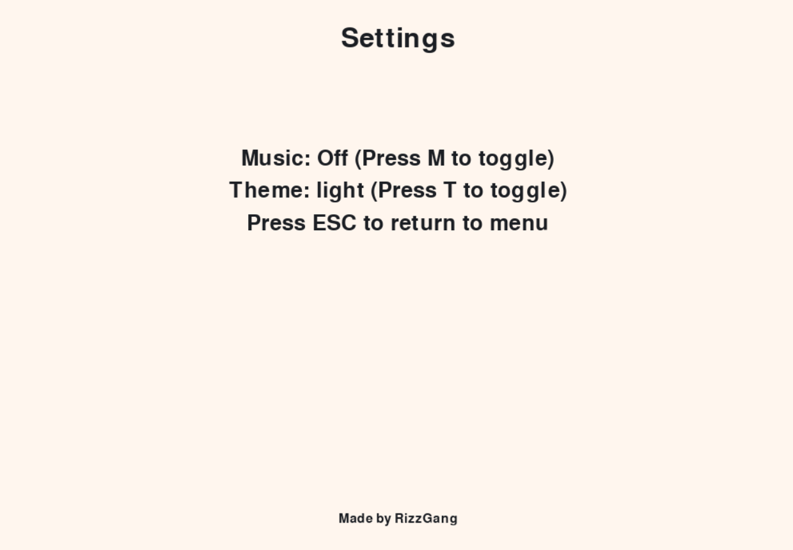
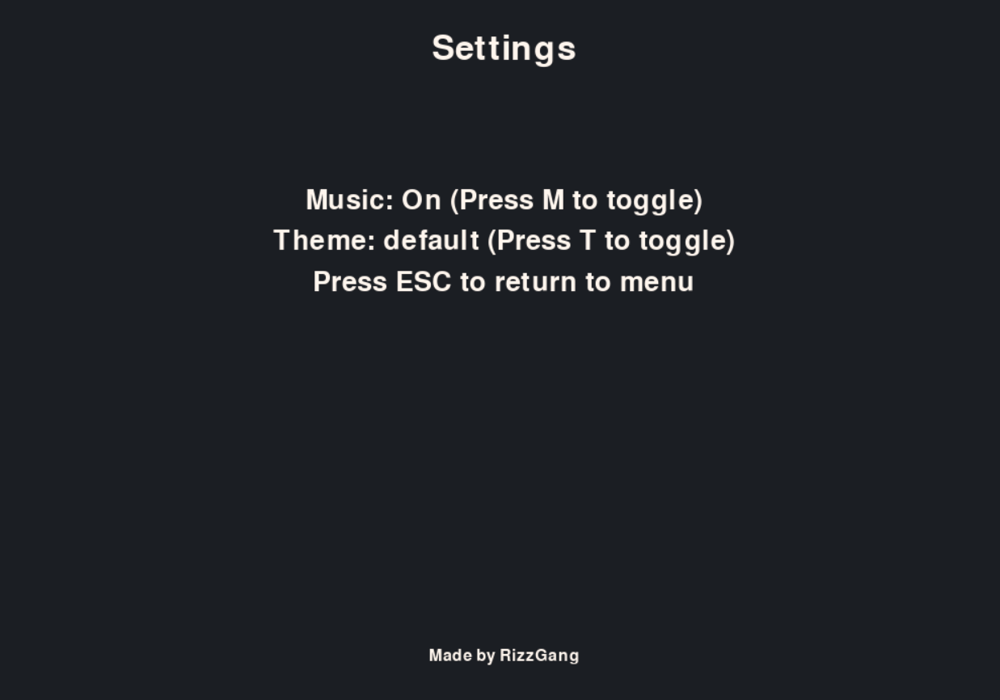

# TetRizz Game
Rizz ur skill in TetRizz

## Deskripsi
Tetrizz adalah sebuah game yang memiliki konsep dimana pemain diharuskan menyusun tetromino-tetromino yang jatuh dari atas layar dengan bentuk yang berbeda-beda. Tujuannya untuk menghindari tetromino tersebut menumpuk hingga melebihi batas layar. Apabila pemain berhasil membentuk baris horizontal penuh, maka baris tersebut akan dihapus dan pemain mendapatkan skor. Terdapat tujuh bentuk tetromino yang disediakan pada game ini diantaranya, tetromino berbentuk huruf T, huruf O atau bentuk persegi, huruf J, huruf L, huruf I, huruf Z dan huruf S.

## Class in Tetrizz
Tetris, PlayerWinScreen, GameOverScreen, SettingsSreen, Settings, SoloTetrisGame, DualTetrisGame, Settings, Menu, GameMode, Themes

## UML


## Penerapan 4 Pilar PBO dalam Game

### Polymorphism
```main.py
def initialize_game_modes(screen):
    return {
        'menu': Menu(screen),
        'settings': SettingsScreen(screen),
        'solo': SoloTetrisGame(screen),
        'dual': DualTetrisGame(screen),
        'gameover': GameOverScreen(screen),
        'player1_win': PlayerWinScreen(screen, "Player 1 Wins!"),
        'player2_win': PlayerWinScreen(screen, "Player 2 Wins!")
    }

while True:
        for event in pygame.event.get():
            if event.type == pygame.QUIT:
                pygame.quit()
                sys.exit()
            if event.type == pygame.KEYDOWN:
                new_mode = game_modes[mode].handle_event(event)
                if new_mode != mode:
                    if new_mode in ['menu', 'gameover', 'player1_win', 'player2_win']:
                        game_modes = initialize_game_modes(screen)
                    mode = new_mode

        dt = clock.tick(144) / 1000.0

        screen.fill(settings.get_theme()['background_color'])
        game_modes[mode].update(dt)
        game_modes[mode].draw()
        pygame.display.flip()
```
### Enkapsulasi
```settings.py
class Settings:
    def __init__(self):
        self.theme = 'default'
        self.music_on = True

    def set_theme(self, theme_name):
        self.theme = theme_name

    def toggle_music(self):
        self.music_on = not self.music_on

    def get_theme(self):
        from themes import themes
        return themes[self.theme]

    def get_block_image_path(self):
        return self.get_theme()['block_image']

settings = Settings()
```

```tetris.py
class Tetris:
    def __init__(self, screen, player_controls, start_x, start_y, next_block_x, next_block_y):
        self.screen = screen
        self.player_controls = player_controls
        self.start_x = start_x
        self.start_y = start_y
        self.next_block_x = next_block_x
        self.next_block_y = next_block_y
        self.grid_width = 10
        self.grid_height = 20
        self.grid = self.create_grid()
        self.current_piece = self.get_new_piece()
        self.next_piece = self.get_new_piece()
        self.score = 0
        self.level = 1
        self.fall_speed = 0.5
        self.fall_time = 0
        self.game_over = False
        self.update_theme()

    def update_theme(self):
        self.block_image = load_image(settings.get_block_image_path())
        self.shadow_color = (128, 128, 128)  # Set the shadow color

    def create_grid(self):
        return [[0 for _ in range(self.grid_width)] for _ in range(self.grid_height)]

    def get_new_piece(self):
        shape = random.choice(SHAPES)
        color = random.choice(settings.get_theme()['block_colors'])
        return {'shape': shape, 'color': color, 'x': self.grid_width // 2 - len(shape[0]) // 2, 'y': 0}

    def rotate_piece(self):
        shape = self.current_piece['shape']
        self.current_piece['shape'] = [list(row) for row in zip(*shape[::-1])]
        if self.check_collision():
            self.current_piece['shape'] = shape  # revert rotation if collision

    def move_piece(self, dx, dy):
        self.current_piece['x'] += dx
        self.current_piece['y'] += dy
        if self.check_collision():
            self.current_piece['x'] -= dx
            self.current_piece['y'] -= dy
            return False
        return True

    #fungsi lainnya dibawahnya
```
### Abstraksi
```game.py
from abc import ABC, abstractmethod

class GameMode(ABC):
    def __init__(self, screen):
        self.screen = screen

    @abstractmethod
    def handle_event(self, event):
        pass

    def update(self, dt):
        pass

    @abstractmethod
    def draw(self):
        pass
```
### Pewarisan

```game.py
class Menu(GameMode):
    def __init__(self, screen):
        super().__init__(screen)
        self.font = pygame.font.SysFont(FONT, 40)
        self.font_title = pygame.font.SysFont(FONT, 50)
        self.font_small = pygame.font.SysFont(FONT, 24)

    def handle_event(self, event):
        if event.key == pygame.K_1:
            return 'solo'
        elif event.key == pygame.K_2:
            return 'dual'
        elif event.key == pygame.K_s:
            return 'settings'
        return 'menu'

    def draw(self):
        screen_center_x = self.screen.get_width() // 2

        title_text_surface = self.font_title.render("TetRizz", True, settings.get_theme()['text_color'])
        title_text_rect = title_text_surface.get_rect(center=(screen_center_x, 50))
        self.screen.blit(title_text_surface, title_text_rect.topleft)
        
        title_text_surface = self.font_small.render("Made by RizzGang", True, settings.get_theme()['text_color'])
        title_text_rect = title_text_surface.get_rect(center=(screen_center_x, 650))
        self.screen.blit(title_text_surface, title_text_rect.topleft)

        text_lines = ["Solo Mode (Press 1)", "Dual Mode (Press 2)", "Settings (Press S)"]
        for i, line in enumerate(text_lines):
            text_surface = self.font.render(line, True, settings.get_theme()['text_color'])
            text_rect = text_surface.get_rect(center=(screen_center_x, 200 + i * 40))
            self.screen.blit(text_surface, text_rect.topleft)
```

# Tampilan Main Menu



# Tampilan Solo Player Menu



# Tampilan Dual Player Menu



# Tampilan Settings Menu




# Tetrizz Game Team
| Nama                    | NIM        | Peran                |
|-------------------------|------------|----------------------|
| Muhammad Yusuf          | 122140193  | Leader Team + Programmer         |
| Asavira Azzahra         | 122140067  | Idea Producer + Programmer        |
| Harisya Miranti         | 122140049  | Dokumenter + Programmer           |
| Febriani Nawang Wulan   | 122140071  | Designer + Programmer             |
| Nayla Fayyiza Khairina  | 122140033  | Concept Researcher + Programmer   |
| Ashoka Tatang Solihin   | 122140051  | Programmer + testor          |


# Referensi
Song Source: [Youtube](https://youtu.be/f-UG6gGAf6c?si=9dJj_4vWguClxv2E)

Game Referensi: [Game Referensi](https://youtu.be/RxWS5h1UfI4?si=_7wnbP27BzCJnx3C)
test commit 
new update
made by me

# Presentasi
[Link Presentasi](https://youtu.be/RxWS5h1UfI4?si=_7wnbP27BzCJnx3C)

# made by tatang
tatang keren bet anjg

Game Referensi: [Game Referensi](https://youtu.be/RxWS5h1UfI4?si=_7wnbP27BzCJnx3C)

